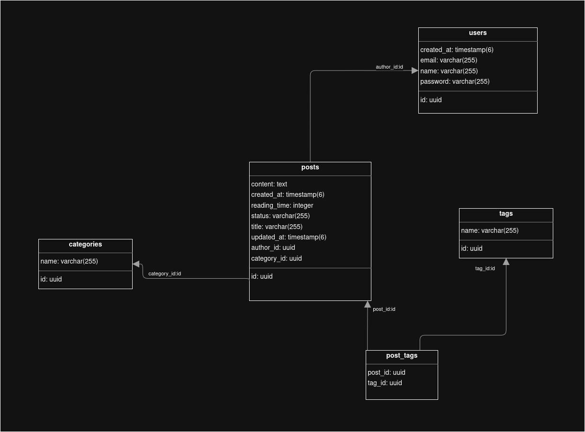

# Blog Platform API

A comprehensive RESTful blog platform built with Spring Boot, featuring user authentication, post management, categorization, and tagging functionality.

## 🚀 Features

- **User Authentication & Authorization**: JWT-based authentication system
- **Post Management**: Create, read, update, and delete blog posts with draft/published status
- **Categories**: Organize posts into categories
- **Tags**: Tag posts for better discoverability and organization
- **Reading Time Calculation**: Automatically calculate estimated reading time for posts
- **Comprehensive Testing**: Unit and integration tests with high coverage
- **API Documentation**: OpenAPI/Swagger documentation
- **Database Management**: PostgreSQL with Docker support

## 🛠️ Tech Stack

- **Backend**: Spring Boot 3.5.0 (Java 21)
- **Database**: PostgreSQL (Production), H2 (Testing)
- **Security**: Spring Security with JWT
- **Documentation**: SpringDoc OpenAPI (Swagger)
- **Testing**: JUnit 5, Mockito, MockMvc, TestRestTemplate, Spring Boot Test
- **Build Tool**: Maven
- **ORM**: JPA/Hibernate
- **Mapping**: MapStruct
- **Development**: Lombok for boilerplate reduction

## 📊 Database Schema

### Entity Relationship Diagram



*Entity relationship diagram showing the core domain model with User, Post, Category, and Tag entities and their relationships.*

### Core Entities

- **User**: Authentication and author information
- **Post**: Blog posts with content, status, and metadata
- **Category**: Post categorization (One-to-Many with Posts)
- **Tag**: Post tagging system (Many-to-Many with Posts)

## 🏗️ Architecture
```
src/
├── main/java/com/raid/blog/
│   ├── config/           # Configuration classes
│   ├── controllers/      # REST API endpoints
│   ├── domain/          # DTOs and domain objects
│   │   ├── entities/    # JPA entities
│   │   └── dtos/        # Data Transfer Objects
│   ├── mappers/         # MapStruct mappers
│   ├── repositories/    # Data access layer
│   ├── security/        # Security configuration
│   └── services/        # Business logic layer
└── test/                # Comprehensive test suite
```

## 🚦 Getting Started

### Prerequisites

- Java 21
- Maven 3.6+
- Docker & Docker Compose (for database)
- PostgreSQL (if running without Docker)

### Installation

1. **Clone the repository**
   ```bash
   git clone https://github.com/RaidThabet/blog-platform
   cd "Blog Platform"
   ```

2. **Start the database**
   ```bash
   cd docker
   docker-compose -f docker-compose.db.yaml up -d
   ```

3. **Build and run the application**
   ```bash
   cd backend
   ./mvnw spring-boot:run
   ```

4. **Access the application**
    - API: http://localhost:8080
    - Swagger UI: http://localhost:8080/swagger-ui/index.html
    - Database Admin (Adminer): http://localhost:8888

### Database Configuration

The application uses PostgreSQL by default. Database settings can be configured in `application.yaml`:

```yaml
spring:
  datasource:
    url: jdbc:postgresql://localhost:5432/blog
    username: postgres
    password: password
```

## 📝 API Endpoints

### Authentication
- `POST /api/v1/auth` - User login
- `POST /api/v1/auth/register` - User registration

### Posts
- `GET /api/v1/posts` - Get all posts
- `GET /api/v1/posts/{id}` - Get post by ID
- `POST /api/v1/posts` - Create new post
- `PUT /api/v1/posts/{id}` - Update post
- `DELETE /api/v1/posts/{id}` - Delete post

### Categories
- `GET /api/v1/categories` - Get all categories
- `POST /api/v1/categories` - Create category
- `PUT /api/v1/categories/{id}` - Update category
- `DELETE /api/v1/categories/{id}` - Delete category

### Tags
- `GET /api/v1/tags` - Get all tags
- `POST /api/v1/tags` - Create tag
- `PUT /api/v1/tags/{id}` - Update tag
- `DELETE /api/v1/tags/{id}` - Delete tag

## 🧪 Testing

Run the comprehensive test suite:

```bash
./mvnw test
```

The project includes:
- Unit tests for services and controllers
- Integration tests for full API flows
- Test configuration with H2 in-memory database

## 📚 Documentation

### API Documentation
- Access Swagger UI at: http://localhost:8080/swagger-ui/index.html
- OpenAPI JSON: http://localhost:8080/api-docs

### Code Documentation
The codebase uses comprehensive JavaDoc comments and follows Spring Boot best practices.

## 🔧 Configuration

### JWT Configuration
JWT settings in `application.yaml`:
```yaml
jwt:
  secret: "your-secret-key"
```

### Database Settings
Configure database connection and JPA settings in `application.yaml`.

---

**Built with ❤️ using Spring Boot**
